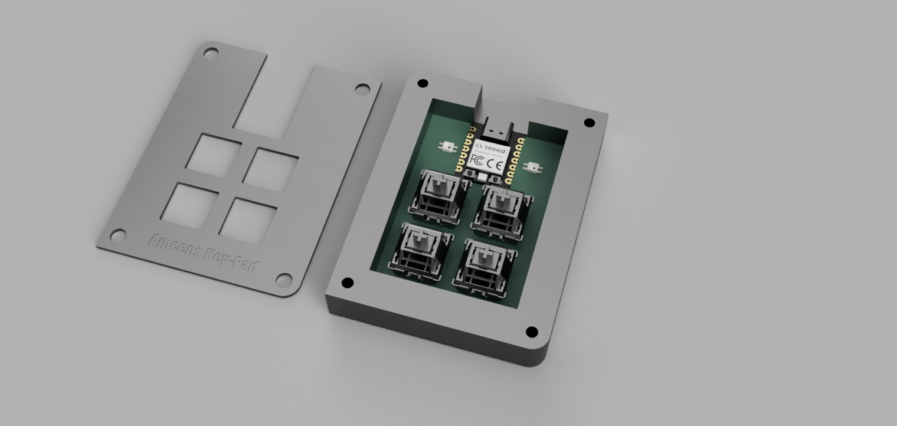
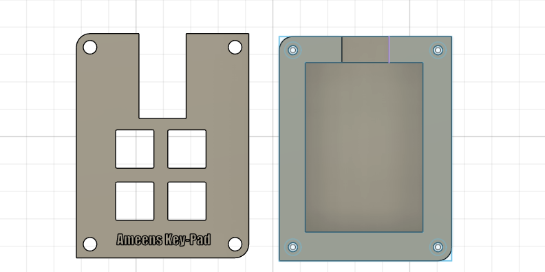

Ameen’s Macropad

Inspiration

I wanted to design a simple yet functional macropad that could be used both for productivity and casual interaction. I created a macropad using 4 switches, 1 rp2040, and 2 leds.

Challenges

This was my frist try on electronics and PCB making.
This project pushed me to properly understand the full hardware design process. Designing the PCB and aligning it correctly with the case required careful measurements and multiple checks. Creating the case in Fusion 360 was also challenging, especially when working with sketches, constraints, and making sure the PCB and switches fit perfectly. Through trial, error, and lots of iteration, I was able to complete a working and clean design.

Specifications

BOM

4× Cherry MX Switches

2× SK6812 MINI LEDs

1× Seeed XIAO RP2040 (through-hole)

4× Blank DSA Keycaps

4× M3×16 Bolts

4× M3 Heatset Inserts

Others

KMK Firmware (planned)

Case(bottom + top) 3D printed

PCB

Schematic

